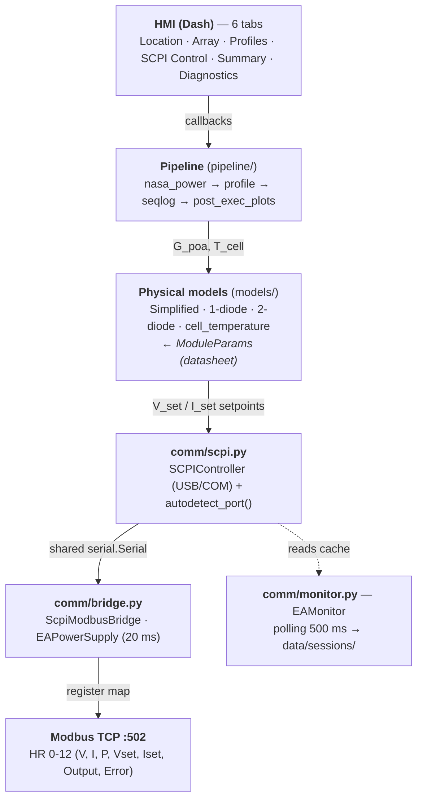

# Photovoltaic panel emulator

An **educational and experimental** platform for testing power devices. The
programmable **EA-PS 10060-170** source (0–60 V / 0–170 A / 5 kW) emulates a
photovoltaic source: it computes the maximum power point (MPP) and the I-V curve
from real solar data (NASA POWER API) with a **single/two-diode model**, generates
a V/I setpoint profile and runs it step by step over SCPI. The **device under test
(DUT)** —a programmable electronic load or an MPPT inverter— is connected at its
output: the platform selects the **emulation envelope** per DUT type, adapts the
analysis and the session record, and provides an offline bench
(`tools/bench/transition_bench.py`) to calibrate the operating mode empirically.

The GUI runs on Dash (browser or desktop), and an optional Modbus TCP bridge
exposes the live measurements to any SCADA or PLC client.

**Validated DUTs** (catalog in `config/devices.py`): `mppt_inverter` (cp
envelope) and `eload` (curve envelope) were validated with real hardware. A
`generic` bring-your-own entry starts on the curve envelope and is meant to be
calibrated with the bench — it is not validated against specific hardware.

---

## Installation

```bash
pip install -r requirements.txt
```

**Python 3.13** (see `.python-version`). `requirements.txt` lists the general
minimums; `requirements-lock.txt` pins the **exact environment used to reproduce
the paper results** (`pip install -r requirements-lock.txt`).

## Quick start

```bash
python app.py            # browser mode → http://localhost:8050
python app.py --desktop  # desktop mode (requires pywebview)
python app.py --debug    # development mode (Flask/Werkzeug auto-reloader)
```

The server runs with `debug=False` by default: the auto-reloader is off (it can
duplicate/orphan the live serial handle mid-session) — enable it with `--debug`
only for development.

---

## System architecture



The source is driven over a single shared serial port; the Modbus bridge and the
measurement monitor reuse it without opening it twice. See
[docs/hardware.md](docs/hardware.md) for the communication details.

---

## Documentation

| Doc | Contents |
|-----|----------|
| [docs/usage.md](docs/usage.md) | Full usage flow through the 6 HMI tabs |
| [docs/modules.md](docs/modules.md) | Code modules (config, models, pipeline, comm, hmi), Modbus register map, file structure |
| [docs/hardware.md](docs/hardware.md) | Serial/USB communication, serial driver notes, portable configuration (env vars), cross-platform compatibility |
| [docs/experiments.md](docs/experiments.md) | Reproducing the paper results (repeated experiments, IEEE figures) |
| [docs/tools.md](docs/tools.md) | Diagnostic tools and benchmarks (Modbus monitor, SCPI latency, mode calibration, smoke tests) |

---

## License

See [LICENSE](LICENSE).
